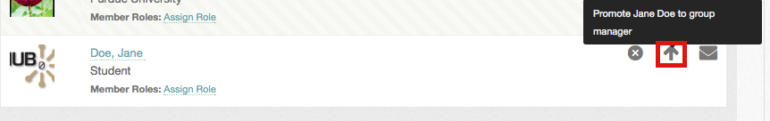

<!--
status: rewritten
reviewed-against: 2.4-main @ 1924c22171
reviewed: 2026-09-09
screenshots: ok
source: https://help.hubzero.org/documentation/240/users/groups/groupmembers
source-id: 3305
modified: 2011-11-04
-->
# Member functions

Everything about a group's membership happens on its **Members** tab:
inviting people, approving requests, handing out roles, promoting managers
and removing members.

## The Members tab

The tab is only open to signed-in users; a visitor is sent to the login page
even when the tab is set to **Any HUB Visitor**.

Four filters run along the top, each with a count:

| Filter | Who it lists |
|---|---|
| **Members** | Everyone in the group |
| **Managers** | The members who manage it |
| **Pending** | People who have asked to join. Managers only |
| **Invitees** | People who have been invited but have not accepted. Managers only |

A search box sits above them. Ordinary members must search before they see
anyone — the **Members** list starts empty, under the heading **Search the
group member directory**, and fills in once you type a name. Managers see the
whole list straight away.

Each row shows the member's photo, name, organisation, any roles they hold
and, if the hub uses them, the date their membership ends. An **Online now**
marker shows who is signed in. **Message** opens a message to that person;
**Message All** at the top of the list writes to everyone the current filter
shows.

## Inviting people

Group managers, and members holding a role with **Invite New Members**, can
invite both hub members and people who have no account yet. The entry is
missing on a **Closed** group.

1. Open the group.
2. Select **Invite Members**, from the **Group Manager** menu or from the
   **Members** tab.
3. In **Names/Email Addresses**, type names, usernames or email addresses
   separated by commas. An autocompleter suggests registered members as you
   type.
4. Optionally write a message in **Customize message sent to invitees**.
5. Select **Send Invites**.

The page then reports which invitations went out and which entries it could
not use. Someone who is already a member, already invited, or not a valid
address comes back in the failures list.

An invited hub member sees **Accept Invitation** and **Decline Invitation**
on the group page and in the **Group Invites** section of `/groups`. An
invitation sent to an email address appears in the **Invitees** list as the
address itself until it is taken up.

To withdraw an invitation, open the **Invitees** filter and select **Cancel**
on the row. You can edit the note the person receives.

## Approving membership requests

On a **Restricted** group, requests land in the **Pending** filter, along
with the reason each applicant gave.

- **Approve** admits them.
- **Deny** opens a form where you can edit the reply they get. Denying is not
  final: a denied user may apply again.

## Roles

A role is a named set of extra permissions inside one group. It lets a member
help run the group without being made a manager.

A role carries a name and any of three permissions:

- **Invite New Members**
- **Edit Group Settings**
- **Create/Edit Group Pages & Categories**

### Creating a role

1. Open the **Members** tab.
2. Select **Add a Member Role**.
3. Give it a **Role Name** and tick the permissions it should carry.
4. Select **Save**.

### Assigning a role

1. Find the member in the **Members** or **Managers** list.
2. Select **Assign Role** on their row.
3. Pick the role and confirm.

A member's roles are listed on their row. The small **x** beside a role takes
it away again. Selecting the role's name filters the list to everyone who
holds it.

## Promoting and demoting managers

A group can have as many managers as it needs.

1. Open the **Members** or **Managers** filter.
2. Find the member and use the arrow button on their row.

The arrow points up for an ordinary member — select it to **Promote** them to
manager. It points down for a manager — select it to **Demote** them. The
change is saved immediately.

The last remaining manager cannot be demoted or removed, so a group is never
left without one. Demote them from the administrator interface if you really
need to; see
[Groups](../../managers/06-users/05-groups.md#membership).

> **Note:** Making someone a manager gives them the power to promote and
> demote others, including you. Only do it for people you trust. A role is
> the smaller step: it hands over one or two specific powers and nothing
> else.

## Removing a member

**Remove** on a member's row cancels their membership. You can edit the note
they receive. A removed member may apply to join again.

## Membership end dates

If the hub allows time-limited memberships, a manager can put an end date on
one. When the date passes the member is removed automatically.

1. Open the **Members** or **Managers** filter.
2. Select **set an end date** — or **change end date** — on the member's row.
3. Set **Ends on**, or tick **Remove the end date and make this membership
   permanent**.
4. Save.

The hub may cap how far ahead the date can be; the form says so when it does.
Everyone sees their own end date at the top of the member list, whether or
not it is close.

> **Note:** End dates are enforced by a scheduled job, not by the page. A
> membership that has just lapsed keeps working until the next run.

## Leaving a group

Open the group, open the **Group Member** menu and select **Cancel Group
Membership**. A manager can only leave if the group has another manager.
