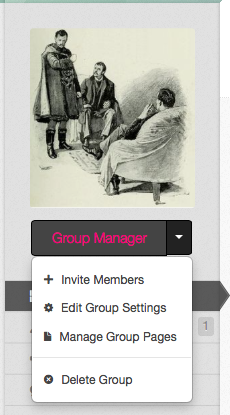
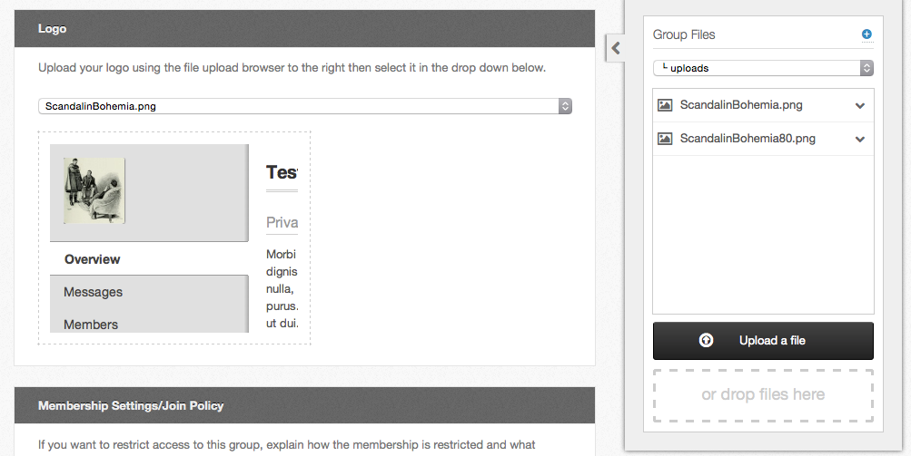

<!--
status: rewritten
reviewed-against: 2.4-main @ 1924c22171
reviewed: 2026-09-09
screenshots: ok
source: https://help.hubzero.org/documentation/240/users/groups/groupcustom
source-id: 3306
modified: 2011-11-04
-->
# Customization

What a group manager can change about a group from the site: its logo and
settings, the pages that make up its content, the categories those pages are
filed under, and — on a super group — the modules around them.

Two entries in the **Group Manager** menu do all of it: **Edit Group
Settings** and **Manage Group Pages**.

Members holding a role can reach them too: **Edit Group Settings** needs the
role permission of the same name, **Manage Group Pages** needs
**Create/Edit Group Pages & Categories**. See
[Member functions](02-groupmembers.md#roles).

## Group settings

**Group Manager** → **Edit Group Settings** opens the same form used to
create the group, with everything filled in. The sections are described in
[Creating and deleting a group](01-createdeleteagroup.md#creating-a-group).
The two that shape how the group looks are **Logo** and, under **Privacy
Settings**, **Access Permissions**.

Select **Save Group** when you are done. Saving emails the group's managers a
summary of what changed.

### The group logo

The **Logo** section only exists once the group has been saved at least once.

1. Open **Edit Group Settings**.
2. In the file browser on the right of the page, select **Upload a file** —
   or drop a file onto it — to put the image in the group's `uploads` folder.
3. Choose it from the **Logo** drop-down. A preview appears below.
4. Select **Save Group**.

> **Note:** On a super group the logo set here does *not* change the logo in
> the group's own template. It is used for branding elsewhere on the hub —
> in resources, courses and the like.

### Which tabs appear

**Access Permissions**, in the **Privacy Settings** section, lists every tab
groups can have on this hub. Each one takes a value:

| Value | Who reaches the tab |
|---|---|
| **Any HUB Visitor** | Everyone, signed in or not |
| **Registered HUB Users** | Anyone with a hub account |
| **Group Members Only** | Members of this group |
| **Disabled/Off** | Nobody. The tab is removed from the menu |

**Overview** cannot be turned off. Whatever is preselected is the hub's own
default for that tab until you change it.

## Group pages

The group's content pages live behind **Group Manager** → **Manage Group
Pages**. The screen has two tabs, or three on a super group:

- **Manage Pages**
- **Manage Page Categories**
- **Manage Modules** — on a super group, or when the hub has switched
  modules on for ordinary groups

**Upload Images/Files** in the header opens the group's file browser, the
same one used for the logo. **Back to Group** returns to the group.

> **Note:** Group pages are separate from the group's wiki. The wiki is its
> own tab, for content the members write together; pages are the group's own
> site.

### Creating a page

1. Open **Manage Group Pages** and select **New Page**.
2. Fill in **Title**. It is required.
3. Fill in **Alias** if you want to choose the segment the page gets in the
   URL. Aliases take lowercase letters, digits, underscores and dashes;
   spaces are removed.
4. Write the page in the **Content** editor. It is required.
5. On the right, set **Status** — **Published** or **Unpublished** — and
   **Privacy**, which is either **Inherits overview tab's privacy setting**
   or **Private Page (Accessible to members only)**.
6. Under **Settings**, optionally pick a **Category**, a **Parent** page and
   an **Order**, and choose whether the page shows **Comments**. Comments
   default to **Use Group Setting**, from the group's own **Page Settings**.
7. Select **Save Page**, or **Apply Changes** from the drop-down beside it
   to save and stay on the form.

An unpublished page stays off the group's menu, but managers can still open
and edit it. A private page is restricted to group members even when the
**Overview** tab is open to everyone; the page list marks it with a padlock.

### Editing a page

From the **Manage Pages** list, select the page's title, or **Manage Page**
on its row. The row's drop-down also offers **Edit Page**, **Preview Page**,
**Publish Page**/**Unpublish Page**, **Version History** and **Delete
Page**.

The list itself shows each page's URL, a padlock on private pages, a coloured
stripe for its category, and who has it open if someone is editing it.
Filter the list by category, or search it by title.

You can also edit a page from the group itself, if the group's **Author
Details** page setting is on: the edit control sits in the byline at the foot
of the page. With **Author Details** off there is no byline and no control,
so go through **Manage Group Pages** instead.

### Reordering and nesting pages

Drag a page by the handle at the right of its row in **Manage Pages**. Drop
it on another page to make it a child. The hub sets how deep the nesting may
go — five levels by default.

### Version history

Every save that changes a page's content creates a new version.

1. Open the page's **Version History**.
2. Step through the versions with **Previous** and **Next**, jump straight to
   a version number with the menu between them, and use **View Source Diff**
   to see what changed in the markup.
3. **Restore This Version** copies the version you are looking at back to the
   top of the history as a new version. Nothing is thrown away.

### Deleting a page

Select **Delete Page** from a page's drop-down in **Manage Pages**. The
group's home page cannot be deleted, published or unpublished.

### Page categories

Categories group pages together and give each one a colour, used as a stripe
in the page list and as a filter.

1. Open **Manage Group Pages** and select the **Manage Page Categories** tab.
2. Select **New Page Category**.
3. Give it a **Title**, and a **Color** if you want one.
4. Select **Save Category**.

Each row's **Manage Category** drop-down offers **Edit Category** and
**Delete Category**, and shows how many pages the category holds.

You can also make a category while editing a page: choose **Other** in the
page's **Category** menu.

### Modules

The **Manage Modules** tab puts blocks of content in the positions around a
group's pages. It is present for every super group; for an ordinary group it
appears only when the hub's administrators have switched group modules on.
The screen is described in
[Super Groups](../../managers/06-users/08-supergroups.md#managing-modules-from-the-site).

## PHP and JavaScript in a page

An ordinary group's page content is filtered: `<script>` blocks and PHP tags
are stripped out before the page is stored. Nothing you can do from the site
changes that.

There are two ways round it, and both need an administrator:

- The group is made a **super group**. Its pages may then contain PHP and
  JavaScript, and it gets a template, modules and a web space of its own.
- Or the group is left an ordinary group and its **Trusted content** page
  setting is turned on, which lifts the filtering for that one group without
  making it a super group.

In either case content that contains `<?`, `<?php` or `<script` is saved
**unapproved** and mailed to the hub's page approvers. Until one of them
approves it, visitors see the previously approved version, or a placeholder
saying the page is awaiting approval. The page shows **Pending Approval** in
**Manage Pages** meanwhile.

> **Note:** A group cannot make itself a super group, turn on trusted
> content, override its site template, or edit its template files and CSS
> from the site. The group file browser reaches only the group's `uploads`
> folder, for every group, super or not. Super group templates are edited on
> the server. See
> [Super Groups](../../managers/06-users/08-supergroups.md) for what the
> status gives a group and
> [Super Groups](../../developers/13-supergroups/README.md) in the developer
> book for the templating itself.

## The group calendar

Members can take a group's events away with them, in two ways. Both live in
the **Subscribe** box below the calendar on the group's **Calendar** tab.

Tick the calendars you want — the group may have several, each with its own
colour, plus **Uncategorized Events** — then:

- **Download** saves an iCalendar file (`.ics`) you import into your own
  calendar application. It is a snapshot: later changes on the hub are not
  reflected.
- **Subscribe** hands the calendar to your default calendar application as a
  live subscription, so changes made on the hub show up in your calendar.

The box also shows the subscription address, so you can copy it into an
application yourself.

If the group's **Calendar** tab is restricted to registered users or to group
members, you are asked for your hub username and password when you subscribe.

> **Note:** Google Calendar does not support authenticated calendar
> subscriptions, so it can only subscribe to a group whose **Calendar** tab
> is set to **Any HUB Visitor**. Otherwise, download the file and import it.

A calendar that is not publishing events is listed but cannot be ticked.
