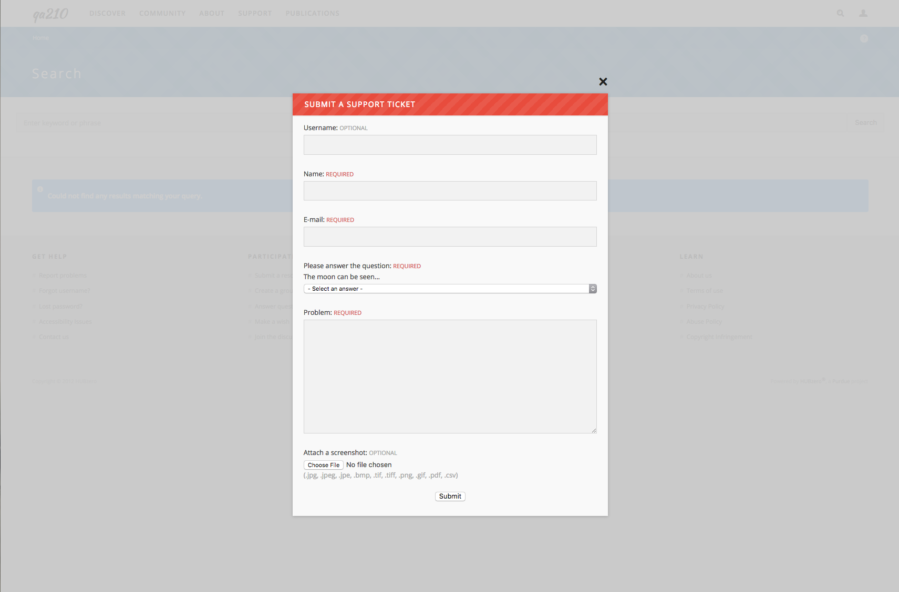
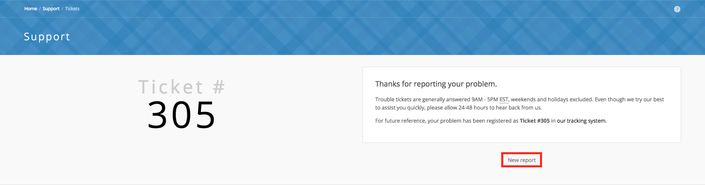
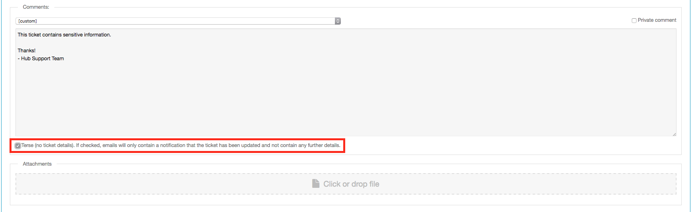

<!--
status: rewritten
reviewed-against: 2.4-main @ 42a7a5b5c7
reviewed: 2026-09-10
source: https://help.hubzero.org/documentation/240/users/support
-->
# Support

Support is where you tell the hub's staff that something is wrong. A
student's simulation tool dies two minutes into every session, she has
a deadline, and she needs a person whose job it is to look. She files a
ticket, the support team answers it, and she follows the conversation
until the problem is fixed.

That is the difference from everything else on the hub that takes a
written message: a ticket is addressed to somebody. It gets a number, a
severity, and eventually a member of staff whose name is on it. Nobody
has to answer a forum thread; somebody is expected to answer a ticket.

Support lives at `/support`, and most hubs also put a **?** tab or a help
link on every page that opens the same form in place.

## Which one do I want?

| If you want to | Use |
|---|---|
| Report something broken, or ask the hub's staff for help | Support — this page |
| Get one answer to a specific question, from anyone on the hub | [Questions and answers](19-questions.md) |
| Discuss something open-ended, where several answers are defensible | [Forum](09-forum.md) |
| Ask for a feature, tool, or change to be built | [Wish list](29-wishlist.md) |

A ticket is for a fault, an account problem, or anything you cannot get
past on your own. It is not the place to ask for a feature: that is what
the [wish list](29-wishlist.md) is for, and the move only runs one way —
a list owner can turn a wish into a support ticket, but a ticket carries
no button that turns it into a wish, so a feature request filed here has
to be posted again by hand. It is also the slowest of the four when the answer is
already written down, so it is worth a minute in the
[knowledge base](13-knowledgebase.md) first.

Your ticket is not public. Only you, the hub's support staff, anyone
watching it, the members of a group it is routed to, and anyone copied
on the latest comment can read it. That makes it the right place for a
log file with a path or an account name in it, and the wrong place for
something the whole community would benefit from seeing answered.

## The Support Center

`/support` is the Support Center. It points you at the other places an
answer might already be waiting — the [knowledge base](13-knowledgebase.md),
[questions and answers](19-questions.md), the [wiki](23-wiki.md),
[resources](21-resources.md), [tags](27-tags.md), and [search](24-search.md) — and
at the two things you can do here: **Report Problems** and
**Track Tickets**. A **Quick Links** panel repeats those, plus the
**Support FAQ's** popup.

## Submitting a ticket

There are two ways in.

**From any page on the hub.** Select the **?** tab. The report form drops
down over the page you were on, already carrying the address you came
from.

**From the Support Center.** Go to `/support/ticket/new`, or follow
**Report Problems** from `/support`.

The form asks for one thing: a **Detailed Description** of what went
wrong. Say what you were doing, what you expected, and what happened
instead. If you are not logged in, you also have to give your **Name** and
**Email** — both required — and you may add your **Username**. Logged in,
those are filled in from your account and hidden.

Below the description is an **Attachments** box. Drag a file onto it or
click to browse; the allowed file types are listed underneath. A
screenshot helps enormously, and a screenshot that includes the address
bar helps more.

If you are not logged in, or your e-mail address has never been confirmed,
a **Human Check** appears — a field you must leave blank, and on many hubs
a simple sum to answer. It is there to keep robots from filling the queue
with spam.

Press **Submit**. The next page gives you your ticket number and a link to
the ticket, thanks you, and tells you that "Trouble tickets are generally
answered 9AM - 5PM EST, weekends and holidays excluded" and to allow
24-48 hours for a reply. A **New report** button starts another one.

> **Note:** If you submit the same text twice within a few seconds — a
> double-clicked button, usually — the second submission is refused and the
> form comes back so you can check it.

The addresses the hub has set for new-ticket notifications are e-mailed
straight away, and the ticket turns up in your own list under
**Reported by me**.

## What happens next

The wait after you press Submit is where most people give up, so it is
worth knowing what is going on.

Your ticket starts as **New** and unassigned. A member of staff reads
the queue, gives it a **Severity** — Critical, High, Normal or Low —
and either answers it or assigns it to whoever handles that kind of
problem, or to a group. Every one of those changes is written into the
ticket's log, under the comments, so you can see the ticket move even
before anyone writes to you.

From there the **Status** column in your ticket list tells you whose
turn it is. Two of the statuses are built in: a ticket you have just
filed reads **New**, and a finished one reads **Closed**. The rest are
defined by the hub, which is why the names differ from hub to hub. A
fresh installation starts with **Open**, **Waiting response**,
**Waiting review** and **Pending update**, plus one closed status for
each way the hub records a resolution.

**Waiting response** is the one that stalls a ticket. It means staff
have asked you something and nobody is working on it until you reply. If
your ticket has sat unchanged for a week, open it and read the last
comment before you chase it — the question may be waiting for you.

When staff comment, the hub emails you a copy by default. Two things can
stop that copy arriving: a comment marked private by staff is never sent
to you and never shown to you on the page, and the staff member can
clear the box that sends you the copy. If you want to be certain, press
**Watch ticket** — a watcher is emailed on every comment and change they
are allowed to see, whoever wrote it. Private comments still do not
reach you.

Some hubs let you answer by replying to the notification email instead
of coming back to the site; those emails carry a line saying "You can
reply to this message, just include your reply text above this area."
Where the hub has not turned that on, or has turned on the terse emails
described below, the email is one-way and you have to reply on the site.

The student's tool crash goes: New that afternoon, Open when a staff
member picks it up, one comment asking which tool version she launched,
Waiting response until she answers, then Closed when the fix ships. She
never had to guess where it was, because the log on the ticket said.

## Tracking your tickets

`/support/tickets` lists tickets. You have to be logged in; the page sends
you to the login form and back again.

The left pane holds saved queries, grouped into folders — **Open
tickets**, **New tickets**, **Closed tickets**, **Reported by me**,
**Assigned to me**, and so on — each with a count. Pick one to fill the
list beside it. If you are not on the hub's support staff, the queries are
filtered so you only ever see tickets you submitted, tickets assigned to
you, and tickets belonging to a group you are in.

Sort the list with the **Sort results** bar: **Age**, **Status**,
**Severity**, **Summary**, **Group**, or **Assignee**. The **Find** box
searches within the query you have selected. Each row shows the ticket
number, its status, when it was opened, when it was last commented on, the
summary, and the severity.

Support staff get more here: a **Watch list** with counts of the open and
closed tickets they are watching, a **Stats** button, and controls for
adding query folders and building their own queries.

## Reading a ticket

`/support/ticket/123` — or clicking the summary in the list — opens one
ticket. You can open a ticket you submitted, one assigned to you, one
belonging to a group you are in, or one you were copied on in the latest
comment; anything else returns a "not authorized" page.

The ticket shows your original report, anything you attached, and the
technical details collected when you filed it: the browser and operating
system, the address you were on, and whether cookies were enabled. Under
it runs the conversation — every comment, with its author and time — and
the log of what changed, so you can see when the ticket was reassigned, or
its severity or status altered. Comments marked private by staff are not
shown to you.

Beside the ticket, its status says **open ticket** or **closed ticket**.

## Adding a comment

The comment form sits at the bottom of the ticket. Write your reply and
press **Submit**. Attach files to a comment the same way you attach them
to a new ticket.

Because the ticket is yours, you also get a single checkbox:

- **Close ticket (issue resolved or no longer relevant)** while it is open.
- **Re-open ticket (issue not resolved?)** once it has been closed.

You do not have to tick it to reopen a closed ticket, though — posting any
comment reopens it, and a closed ticket carries a note saying so.

## Watching a ticket

**Watch ticket** in the sidebar adds the ticket to your watch list. While
you are watching, you are e-mailed about every comment and every change.
**Stop watching** ends it. Watchers are notified anonymously — nobody else
sees who is watching.

## Terse comment e-mails

Hub administrators and support staff see a **Terse** checkbox under the
comment box.

Left clear, the e-mail sent to the ticket's recipients contains the whole
comment. Checked, they get only the ticket number and a line saying the
ticket has been updated, with a link to come and read it. Hubs that must
keep sensitive material out of e-mail — those working to HIPAA or FISMA
rules — turn this on hub-wide, and then the box is checked for every
comment; staff can still clear it one comment at a time. See
[Support](../managers/09-components/34-support.md) in the managers book.

## Reporting abuse

Reporting abuse is the other thing that comes here, and it is not a
ticket. Where somebody has posted something offensive, off-topic, or
spam on a forum thread, an answer, a blog comment, a review or a wish,
you tell the hub's staff about it with **Report abuse** rather than
arguing with them in public.

Comments, reviews, and other member-written content around the hub carry a
**Report abuse** link. It opens a short form at `/support/reportabuse`
showing the content you are reporting and asking for a **Reason** —
*Offensive content*, *Stupid*, *Spam*, or *Other* — with a box for
anything you want to add. You have to be logged in.

Submitting gives you a report number. The reported content does not
disappear: it stays where it is with its text replaced by a notice
saying it has been reported, so everyone can see that something was
there and that it is being looked at. A member of staff reviews the
report and either releases the content — the notice goes and the text
comes back — or takes it down; if it is taken down, the person who
posted it is e-mailed. Where the hub runs points, you may be credited
some for a report that turns out to be valid.
