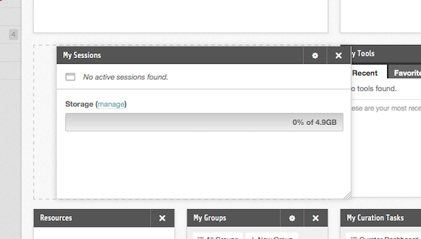

<!--
status: rewritten
reviewed-against: 2.4-main @ 1924c22171
reviewed: 2026-09-09
screenshots: ok
source: https://help.hubzero.org/documentation/240/users/dashboard
source-id: 3311
modified: 2013-02-15
imported: 2026-09-09
-->
# Member dashboard

The dashboard is the first tab of your member area and the page you land on
after logging in. It is a grid of modules — small panels showing one thing
each — that you arrange yourself. Typical ones are **My Sessions**, which
lists your running tool sessions and your disk usage, **My Groups**, **My
Projects**, **My Tools**, **My Questions**, and **My Contributions**.

Only you see your dashboard. Opening another member's profile shows their
public tabs; the Dashboard tab is not one of them.

A new account starts from the arrangement the hub set as its default. Whatever
you change is saved as you change it and is there again at your next login.

> **Note:** The dashboard needs JavaScript. Without it the page says
> *Javascript must be enabled to personalize your dashboard.* and nothing can
> be moved.

## Adding a module

1. Select **Add Modules** at the top right of the dashboard.
2. A pane opens listing every module the hub offers for the dashboard. Choose
   one from the list on the left to see its description, version, and any
   screenshots the module ships.
3. Select **Install Module**. The module is added to your dashboard.

Modules already on your dashboard are shown as **Module Installed** and cannot
be added twice.

> **Note:** The list is not the hub's whole module library — it is the modules
> published to the dashboard position. If something you expect is missing, the
> hub has not made it available there.

## Removing a module

1. Move the pointer over the module. A small toolbar appears in its top right
   corner.
2. Select the ✖ icon. It expands into a red **Remove** button.
3. Select it again to confirm. If you wait more than a few seconds it reverts
   to the icon and nothing is removed.

## Rearranging and resizing

- **Move.** Press and hold on a module's title bar, drag it where you want it,
  and release. The other modules move out of the way.
- **Resize.** Drag the bottom-right corner of a module.

Both are saved as soon as you let go.

## Module settings

Some modules carry their own settings — how many items to list, which tab to
open on. Those modules show a ⚙ icon beside the remove icon; selecting it
opens the settings above the module's content, where **Save** applies them.
Modules with nothing configurable have no ⚙ icon.

Settings you change here apply to your copy of the module only.

## If your hub has locked the dashboard

An administrator can switch personalisation off. When that has been done, the
**Add Modules** button is absent and modules cannot be dragged, resized, or
removed; everyone gets the hub's arrangement. The dashboard still works, it
just cannot be changed.

An empty dashboard reads *Your Dashboard is Empty*, with the advice to use the
add modules button in the top right.
