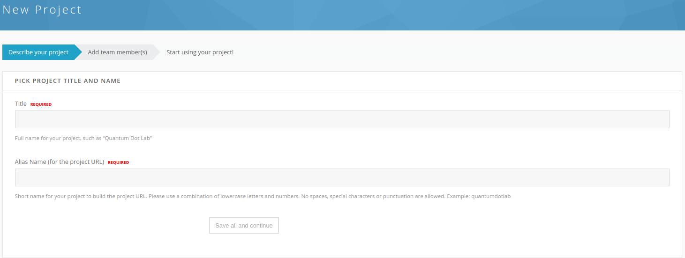
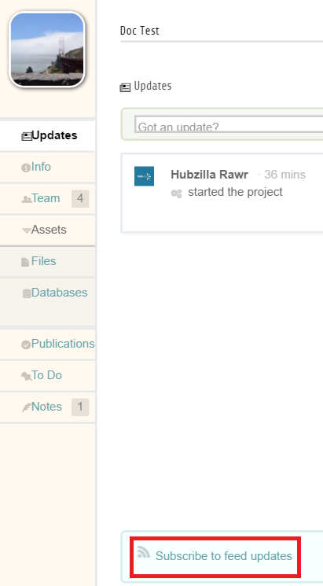
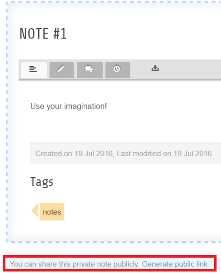
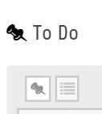
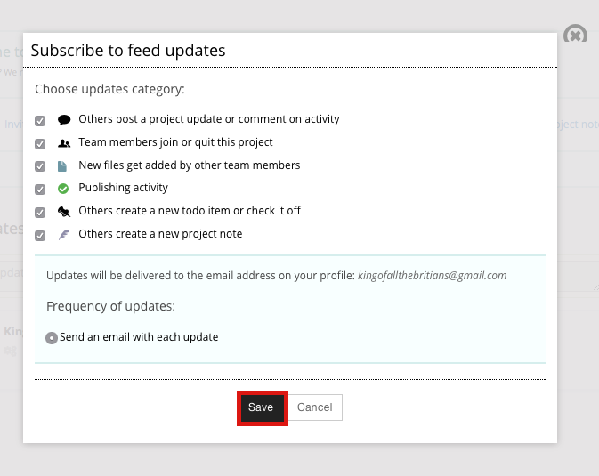
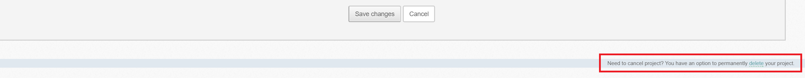

<!--
status: rewritten
reviewed-against: 2.4-main @ 1924c22171
reviewed: 2026-09-09
screenshots: stale
source: https://help.hubzero.org/documentation/240/users/projects
source-id: 3313
modified: 2013-07-10
imported: 2026-09-09
-->
# Projects

A project is a private workspace you and a few colleagues share on the hub:
a file area, a place for notes, a to-do list, an activity feed, and — where
the hub offers them — data stores and a route to publishing your work. You
create a project yourself, you decide who is on the team, and nothing in it
is visible to anyone else unless you make it so.

Projects live at `/projects` on the hub. The **Learn more** button on that
page opens `/projects/features`, the hub's own tour of what a project can do.

## Finding your projects

Go to `/projects`. The page has two halves. The top explains what a project
is and offers **Start a project** and **Learn more**; the **My Projects**
section below lists every project you belong to. If you are not logged in,
that section asks you to log in first.

**Browse public projects**, at the top right, lists the projects whose
owners have made them public. You can search the list, sort it by title or
owner, and filter it to show archived projects.

> **Note:** **Start a project** appears only if the hub lets you create one.
> Some hubs restrict project creation to the members of a named group. If
> you do not see the button, ask the hub's support staff.

## Starting a project

Setup is a short wizard. By default it has two steps — **Describe your
project** and **Add team member(s)** — and a third, **One last thing...**,
appears only on hubs that have turned on the agree-to-terms screen. The
progress bar at the top of each step shows where you are.

### Step 1: describe your project

1. Select **Start a project**.
2. Type the project's full name in **Title** — for example, *Quantum Dot
   Lab*.
3. Type a short name in **Alias Name (for the project URL)**. Use lowercase
   letters and numbers only: no spaces, punctuation, or special characters.
   The alias becomes the project's address, `/projects/<alias>`, and cannot
   be changed afterwards. The form checks the name as you type and suggests
   an alternative if it is taken.
4. Answer *Would you like to provide more information about your project?*
   with **Yes, I'll do it now** to fill in the rest of the step, or **No,
   later** to skip straight to the team.
5. In **About**, describe the project. This is what visitors see if the
   project is public.
6. Under *Include project in search?* choose one:
   - **Project is hidden from search and listings (private project)**
   - **Anyone can find this project in search & listings and view its basic
     information (public project)**
7. Under *Add a project picture*, upload an image to use as the project's
   thumbnail.
8. Select **Save all and continue**.

### Step 2: add team members

The second step is the team editor. Add people now or leave it empty and
come back later — you are already a member, as the project's manager.

1. Choose the role for the people you are about to add: **manager**,
   **collaborator**, or **reviewers**.
2. Type a name in **Individual**, or an email address to invite someone who
   has no account on the hub yet. Type a group name in **User group** to add
   everyone in a hub group at once. Both boxes suggest matches as you type;
   pick one from the list.
3. Select **add**.
4. Repeat for each person or group. The table below the form lists everyone
   on the team.
5. Select **Save all and continue**.

The three roles are:

| Role | Can |
|---|---|
| Manager | Invite and remove team members, change project information and settings, and everything a collaborator can do |
| Collaborator | Upload and manage project files, edit project publications, use the project's tools such as notes and to-do items |
| Reviewer | View files, publications, notes, to-do items and team members. Read only |

### Step 3: agree to terms

Where the hub has enabled it, a final screen asks you to accept the hub's
privacy terms before the project opens. Depending on how the hub is
configured it may also ask:

- **Are you planning to upload datasets containing any sensitive or
  restricted data?** — either as a single acknowledgement that the project
  will *not* hold sensitive data, or as a set of checkboxes for
  export-controlled data, IRB-governed data, HIPAA-protected health
  information, and FERPA-protected student records. Ticking one of the
  latter two may add an extra acknowledgement you have to confirm.
- **Grant information** — grant title, PI, award number, agency and budget,
  if the hub collects it.

Tick the box next to *Yes, I read, understand and acknowledge* the privacy
terms, then select **Save all and continue**. The project opens.

On hubs that require approval for sensitive-data projects, answering yes to
the export, HIPAA, or FERPA questions puts the project into *pending
approval* instead. An administrator reviews it before it becomes active.

## Inside a project

Each area of a project is a tab. Which tabs you see depends on which project
plugins the hub has enabled and configured:

| Tab | What it is |
|---|---|
| Updates | The activity feed: a stream of what everyone on the team has done, with a box to post your own update and comment on others |
| Info | The project description, and the grant information if the hub collects it |
| Team | The member list and, for managers, the team editor |
| Files | The project's file area. See [Project files](02-projectfiles.md) |
| Databases | Searchable tables built from a spreadsheet. See [Databases](05-databases.md) |
| Notes | Wiki-style pages for anything the team needs to write down |
| To Do | Shared task lists |
| Publications | Drafts and released versions of work published from the project |

Two more plugins ship but add no tab of their own: **Projects - Watch**
provides the feed subscription described below, and **Projects - Links**
supplies external content that publications can cite.

The tabs sit in a menu down the left of the project page. Where the hub uses
the extended page layout instead, they run across the top and **Files** and
**Databases** are grouped under an **Assets** heading.

> **Note:** The picture above shows the extended layout, where **Files** and
> **Databases** sit under **Assets**. In the standard layout, which is the
> default, every tab is listed on its own.

At the top right of every project page is your role in it — *Project
manager*, *Project collaborator*, or *Project reviewer*. Hover over it for
the menu of project-wide actions: **Edit project**, **Invite people to
join**, **View public profile** (public projects only), and **Leave this
project**.

## Editing project information

1. Open the project.
2. Hover over your role at the top right and select **Edit project**.
3. Change the **Title** and edit the description in **About**.
4. To change the thumbnail, choose a file under *Upload new image* and
   select **Upload**. It replaces the existing one.
5. Select **Save changes**.

Managers can always do this. On hubs that allow it, collaborators can edit
the description too.

The alias cannot be changed. Ask the hub's support staff if a project's
address has to move.

## The team

The **Team** tab lists everyone on the project with their role, when they
joined, when they last visited, and — for members who came in through a hub
group — which group. The list itself is read-only, except that a manager
sees **Approve request** and **Deny request** beside anyone who has asked to
join.

Managers get an **Edit Team** button above the list. It opens the same
editor used during setup: add people, change a member's role by selecting
it, tick the boxes beside members and select **delete** to remove them.
Under *Project owner* in that editor, **Edit** hands the project to someone
else.

Any member of a project with more than one member can leave it: hover over
your role at the top right and select **Leave this project**.

> **Warning:** The **Edit Team** button, and the **Invite people to join**
> entry in the role menu, both open the team editor only if the hub has
> turned on *Allow project settings editing?*, which is off by default.
> Where it is off, both land on the Edit Info screen instead, and there is
> no other way to reach the editor. Add everyone you need during setup, or
> ask the hub's support staff to enable the setting.

### Group-owned projects

A project can be owned by a hub group rather than by a person. In a
group-owned project the team editor offers a choice:

- **Include all group members.** Everyone in the group has project access
  for as long as their group membership lasts, and cannot be removed
  individually.
- **Specify membership.** You choose which group members get access.

Add people from outside the group in the usual way.

## Notes

The **Notes** tab is a small wiki. Create a page, write in it, tag it, and
comment on it. Each note keeps its history, so you can see what changed.

A note is private to the team until you share it. At the bottom of a note,
select **Generate public link**. The pop-up gives you an address anyone can
open — paste it into email, chat, or a web page. Select **Close this** to
dismiss the pop-up. In a public project you can also choose whether the note
is *listed* on the project's public page or reachable only by its link.

## To Do

The **To Do** tab holds the project's task lists. Add an item, assign it to
someone, and check it off when it is done. Two buttons above the list switch
the layout: **Pinboard view** shows items as cards you can drag to reorder,
**List view** stacks them as rows. Both show the newest first.

The sidebar lists the project's to-do lists. **My to do's** is a built-in
list of everything assigned to you; you cannot add to it directly, because
it fills itself from items assigned to you elsewhere. Select **Add** to make
a list of your own, and pick a list when you create an item.

## Following what happens

Everything the team does shows up on the **Updates** tab. To get it by
email as well, find the **Subscribe to feed updates** box in the sidebar of
a project page and select it.

Tick the categories you want to hear about — project updates and comments,
team changes, new files, publishing activity, new to-do items, new notes —
and select **Save**. Mail goes to the address on your hub profile. Come back
to the same box, now labelled **Manage feed subscription**, to change or
cancel it.

Some hubs subscribe members automatically when they join a project; in that
case the box lets you opt out.

## Deleting a project

Deleting a project is a manager's job and it cannot be undone from the front
end.

1. Hover over your role at the top right and select **Edit project**.
2. Under *Need to cancel this project?* in the left column, select
   **Delete**.
3. Confirm with **Yes, delete**.

> **Note:** The picture above shows an older Edit Project screen, where
> **delete** was a link at the foot of the page. It is now a **Delete**
> button in the left column, under the same wording.

The project disappears from your list and from search, and the hub revokes
the file-system access that went with it. The files themselves stay on the
hub's disk. If you delete a project by mistake, ask the hub's support staff:
an administrator can still reach it.

Archiving is the gentler option, and only an administrator can do it. An
archived project keeps its files and stays readable, but nobody can change
it.

## What administrators control

Much of what a project offers is set hub-wide, not per project: which tabs
exist, how much disk space a project gets, whether the setup wizard asks
about sensitive data or grants, and which external storage providers a
project can connect to. Those settings are described in
[Projects](../../managers/09-components/26-projects/README.md) and
[Project file connectors](../../managers/09-components/26-projects/projectfileconnect.md)
in the managers book.
