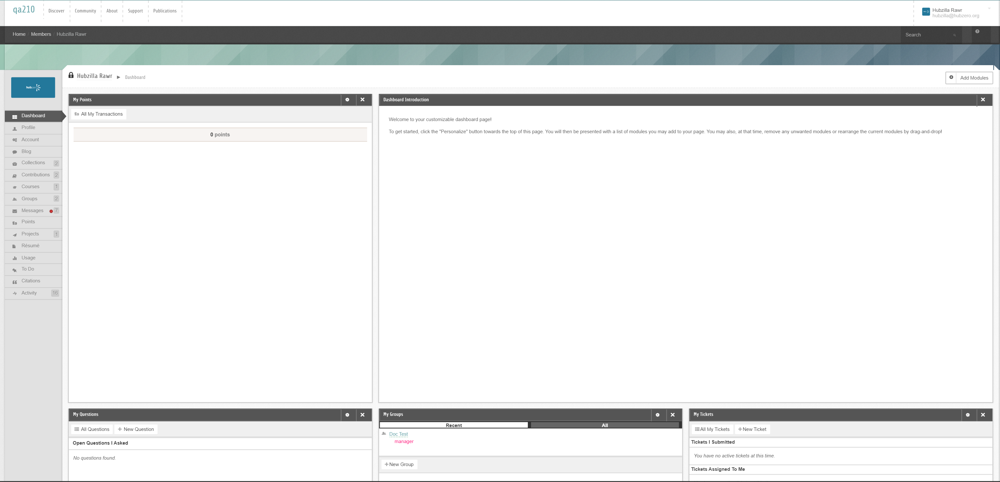
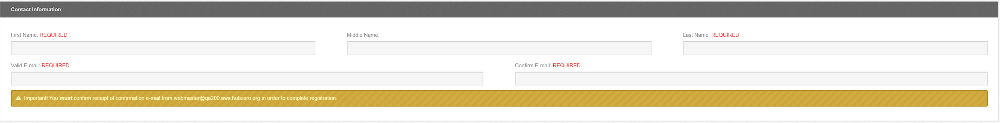

<!--
status: rewritten
reviewed-against: 2.4-main @ 1924c22171
reviewed: 2026-09-09
screenshots: stale
source: https://help.hubzero.org/documentation/240/users/registration
source-id: 3324
modified: 2014-11-14
imported: 2026-09-09
-->
# Registration

Registering creates a member account: a username, a password, an email
address the hub can reach you at, and whatever else your hub asks for. Once
the account is confirmed you can contribute content, join groups, and run
tools.

No two hubs ask exactly the same questions. The fieldsets below are the ones
built into the software; the **Personal Information** fieldset in the middle
is entirely the hub's own, and any of the standard fields can be made
required, optional, read-only, or hidden. Administrators set that up on the
**Users > Members > Registration** screen, described in the
[Registration chapter](../managers/06-users/02-registration.md) of the Hub managers
book.

> **Note:** The images on this page were captured from an older release. The
> first one shows a member dashboard rather than the registration form and is
> misleading; ignore it until the screenshots are recaptured.

## Creating an account

1. Go to the hub's front page and select **Register**, or go straight to
   `https://yourhub.org/register`. The login form also carries a
   **Create an account** link, which goes to the same place.
2. If the hub accepts logins from other services — Google, ORCID, Globus,
   Shibboleth and others are all possible — a **Connect With** panel appears
   at the top of the form. Using one fills in part of the form for you and
   links that account to your new hub account.
3. Under **Login Information**, type a **Username**. The hint under the box
   says what is allowed: *Combination of lowercase letters and numbers. No
   spaces or punctuation.* When you leave the box, the hub checks the name
   against the accounts that already exist and reports underneath whether it
   is available.

   > **Note:** Usernames cannot be changed afterwards.
4. Type a **Password**, then repeat it in **Confirm Password**. The list of
   rules under the boxes is your hub's own — it is a table an administrator
   edits, so its length and content vary. The list updates as you type, marking
   each rule as it is satisfied.
5. Under **Contact Information**, fill in **First Name**, **Middle Name**, and
   **Last Name**. Middle name is never required.
6. Type your address in **Valid E-mail** and again in **Confirm E-mail**. A
   warning under the boxes names the address the confirmation message will
   come from.

   > **Important:** The address has to work. Unless the hub has switched
   > confirmation off, the account cannot be used until you follow a link sent
   > to it.

   

   If the address already belongs to an account, the form says so and offers
   two buttons instead: one that emails you the existing account's details, and
   one that opens a support ticket asking for that account's resource limits to
   be raised.
7. Answer the questions in **Personal Information**. These are your hub's own
   fields — organisation, discipline, position, and so on. Fields marked
   *required* have to be answered; the rest can be left blank and filled in
   later from your profile. Some fields reveal further questions depending on
   the answer you give.
8. Under **Receive Email Updates**, tick or clear the box beside *Would you
   like to receive email updates (newsletters, etc.)?* It is ticked by
   default.
9. Complete the **Human Check**. Its contents depend on which CAPTCHA plugin
   the hub runs: an image of distorted characters to retype (with a
   *Letters not clear? Refresh CAPTCHA.* link), an arithmetic question, or
   Google reCAPTCHA.

   > **Note:** This fieldset also contains a box labelled *Please leave this
   > field blank.* That is a trap for automated form fillers. Leave it empty,
   > as it says.
10. Under **Terms & Conditions**, open the **Terms of Use** link, read it, and
    tick *Yes, I have read and agree to the Terms of Use.*
11. Select **Create Account**.

## Activating the account

If confirmation is switched on, the hub answers with *Account Created!* and a
four-step reminder: find the email, follow the activation link, log in, done.
The message names the address it was sent to.

Follow the link and log in. That confirms the address and, on a hub that does
not also require administrator approval, the account is ready.

If nothing arrives:

- The message is generated automatically and some filters treat it as spam.
  Check the spam folder first.
- Log in and use the resend option, or contact the hub's support.
- If you mistyped the address, correct it from your profile. Changing an email
  address un-confirms the account and sends a fresh confirmation link, so you
  will have to confirm again.

Some hubs also require an administrator to approve new accounts. In that case
the account stays unusable after you confirm, until someone approves it. You
are emailed when that happens.

## Third-party logins

An account created by logging in through another service starts out
incomplete: the hub does not get a usable email address from every provider,
so it holds you on the registration form until you supply the missing pieces.
Until you do, you cannot be messaged by other members and the account shows as
incomplete.

You can link further services to an existing account, and set a local
password, from the **Account** tab of your member area.
